# Arquitectura

## Modelo de despliegue: Hibrido

GUIA no es SaaS puro ni self-hosted puro. Cada capa tiene su modelo de despliegue segun la sensibilidad de los datos.

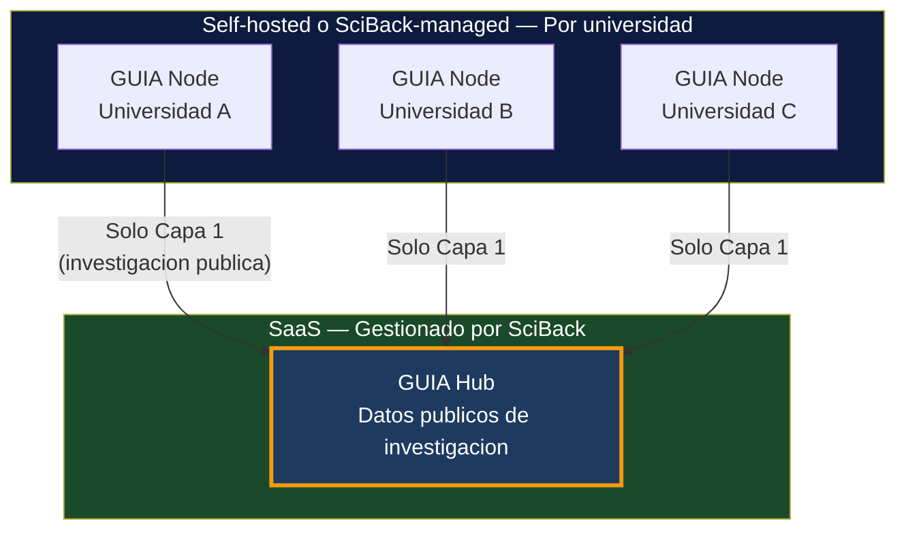

| Componente | Modelo | Razon |
|-----------|--------|-------|
| **GUIA Node** | Self-hosted o SciBack-managed | Datos sensibles (notas, deudas). Necesita acceso a red interna (AD, SIS) |
| **GUIA Hub** | SaaS (gestionado por SciBack) | Solo datos publicos. Un Hub central para N universidades |
| **Keycloak** | Co-desplegado con el Node | Cada universidad tiene su realm |
| **midPoint** | Opcional, co-desplegado | Solo para universidades con infra compleja |

---

## GUIA Node — Arquitectura completa

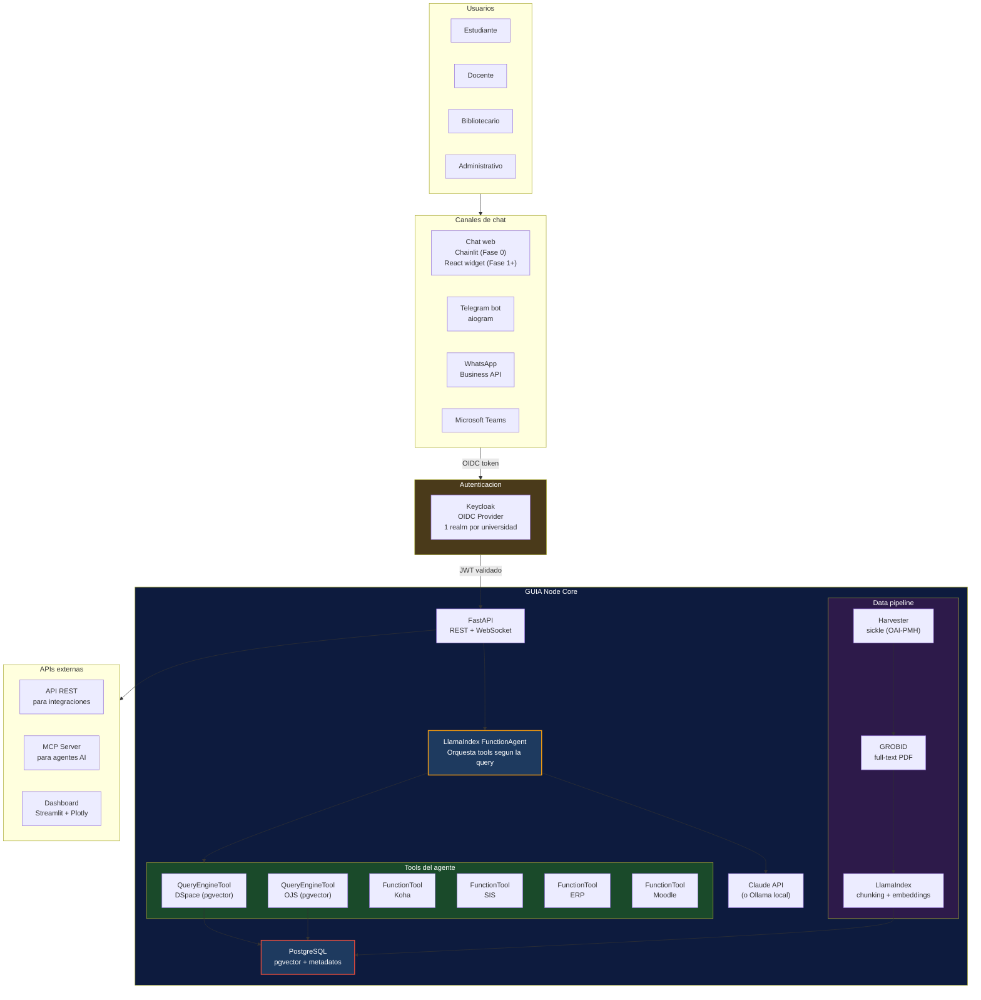

---

## Stack tecnico del Node

| Componente | Tecnologia | Licencia | Para que |
|-----------|-----------|----------|----------|
| RAG engine | LlamaIndex (FunctionAgent) | MIT | Chunking, embeddings, reranking, tool calling |
| OAI-PMH | sickle | BSD | Harvesting DSpace/OJS |
| PDF full-text | GROBID + grobid-client-python | Apache 2.0 | Extraccion de texto de papers |
| Vector store | pgvector (PostgreSQL) | MIT | Embeddings + busqueda semantica |
| API | FastAPI | MIT | REST + WebSocket, async |
| Chat web | Chainlit (Fase 0) / React (Fase 1+) | Apache 2.0 | Interfaz de chat |
| Telegram | aiogram | MIT | Bot gratis |
| Dashboard | Streamlit + Plotly | MIT | Visualizacion produccion cientifica |
| SSO | Keycloak | Apache 2.0 | OIDC, multi-tenant por realms |
| IGA | midPoint (Fase 1+) | EUPL | Usuario canonico multi-fuente |
| LLM | Claude API / Ollama | — | Generacion de respuestas |
| Deploy | Docker Compose | — | Un solo `docker compose up` |

---

## Docker Compose — Servicios del Node

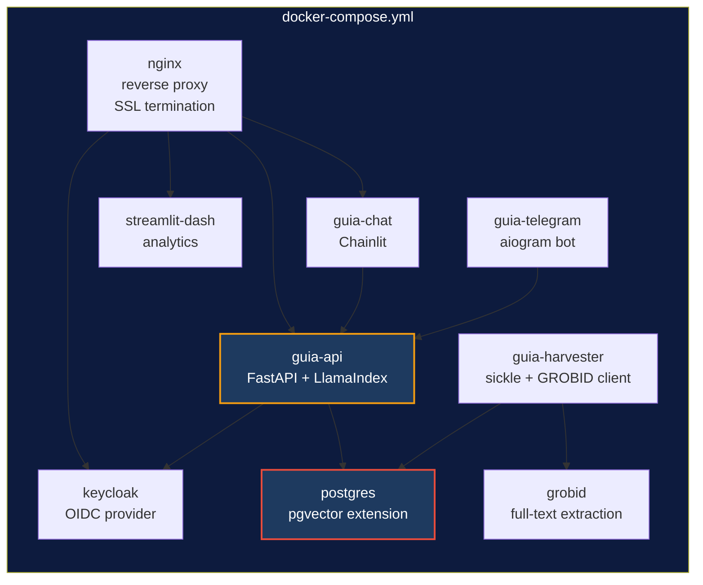

---

## Arquitectura de identidad

### Fase 0 — Keycloak solo (1 universidad, 1 fuente)

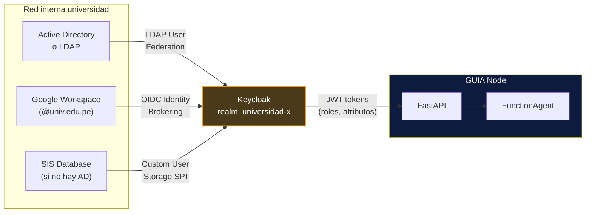

Keycloak maneja 3 escenarios comunes de universidades LATAM:

- **Tiene AD/LDAP:** User Federation directo
- **Tiene Google Workspace:** OIDC Identity Brokering (login con cuenta Google institucional)
- **Solo tiene base de datos:** Custom User Storage SPI o usuarios manuales en Keycloak

---

### Fase 1+ — midPoint + Keycloak (multiples fuentes heterogeneas)

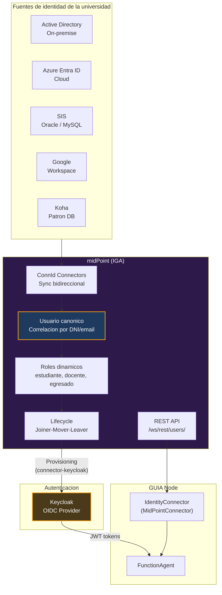

**Flujo:**

1. midPoint sincroniza identidades de todas las fuentes via ConnId
2. Crea un **usuario canonico** con reglas de correlacion (DNI, email)
3. Asigna **roles dinamicos** (estudiante activo, docente TC, egresado)
4. **Provisiona** el usuario en Keycloak via connector-keycloak
5. Keycloak emite **tokens OIDC** con roles y atributos
6. GUIA Node consulta **midPoint REST API** para atributos detallados

**Beneficio clave:** El codigo de GUIA Node es identico en todas las universidades. midPoint absorbe toda la heterogeneidad.

---

### Conector de identidad abstracto

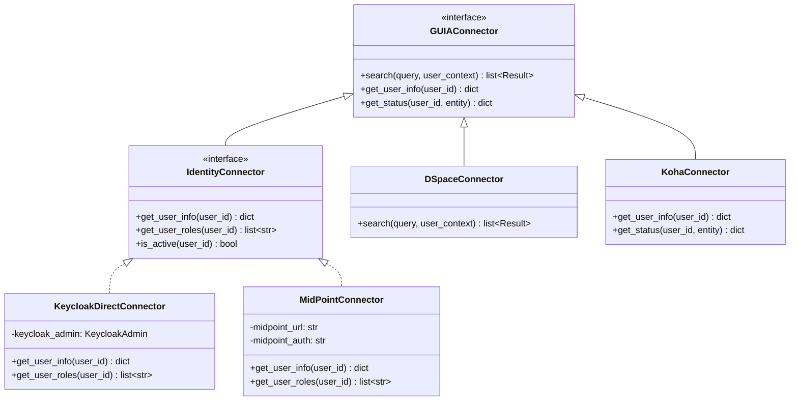

---

## Arquitectura de agentes

### Fase 0: RAG simple → Fase 0.5: FunctionAgent con tools

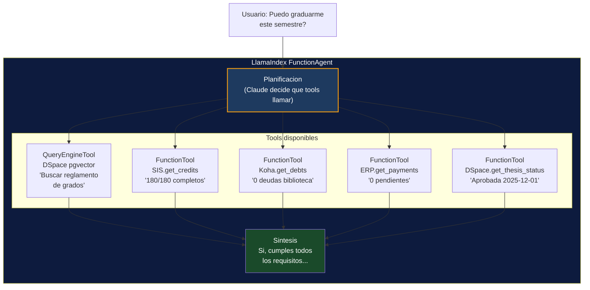

### Ruta de escalado de agentes

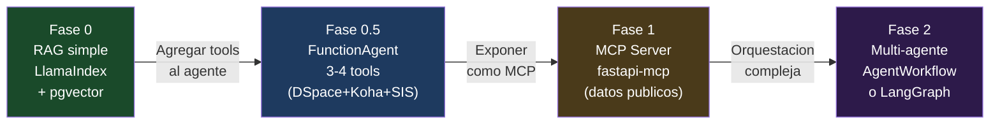

---

## GUIA Hub — Federacion

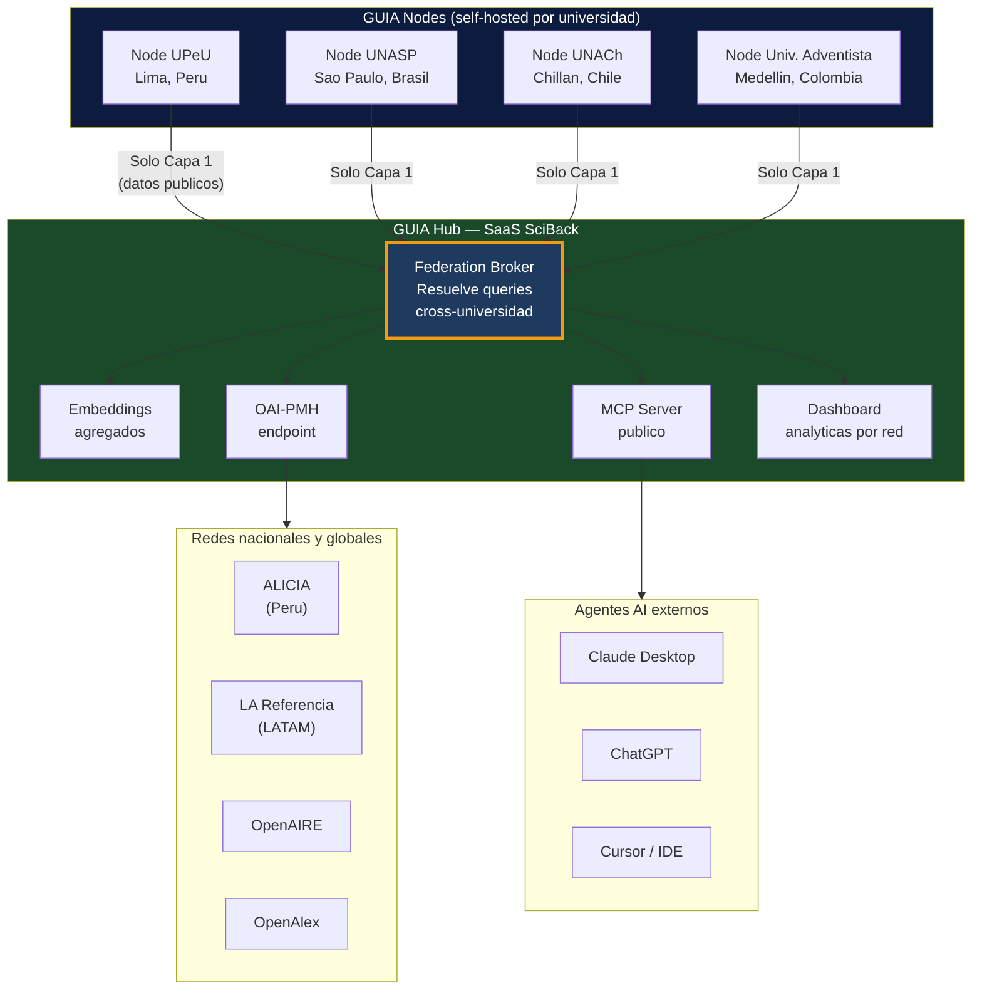

**Datos que fluyen al Hub:** Solo Capa 1 (investigacion publica): metadatos Dublin Core, abstracts, full-text de acceso abierto.

**Datos que NUNCA salen del Node:** Capa 2 (campus): notas, deudas, matricula, prestamos, credenciales.

---

## Notificaciones proactivas (Fase 0.5)

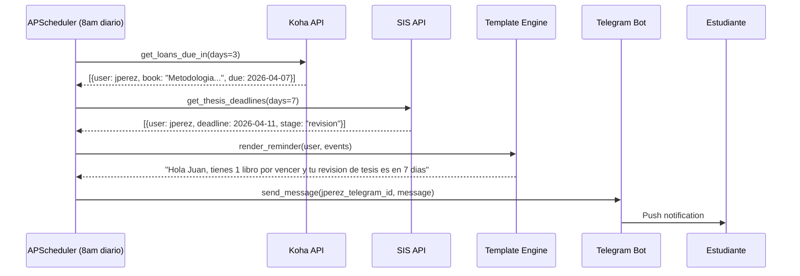

En Fase 0.5 las notificaciones usan templates sin LLM. En Fase 1+ el LLM personaliza ("vi que tu tesis es sobre X, hay 3 nuevos articulos en OJS que podrian ser utiles").

---

## Infraestructura AWS — Node piloto UPeU

| Servicio | Especificacion | Costo estimado |
|---------|---------------|----------------|
| EC2 | t3.xlarge (4 vCPU, 16GB RAM) | ~$120/mes |
| EBS | 100GB gp3 | ~$8/mes |
| S3 | Backups y PDFs | ~$5/mes |
| CloudWatch | Logs y alertas | ~$5/mes |
| **Total** | | **~$138/mes** |

Deploy: Docker Compose con Nginx reverse proxy + SSL (Let's Encrypt).

Servicios en el compose: nginx, guia-api (FastAPI), guia-chat (Chainlit), guia-telegram (aiogram), guia-harvester (sickle), grobid, postgres (pgvector), keycloak, streamlit-dash.

---

## Fases de desarrollo

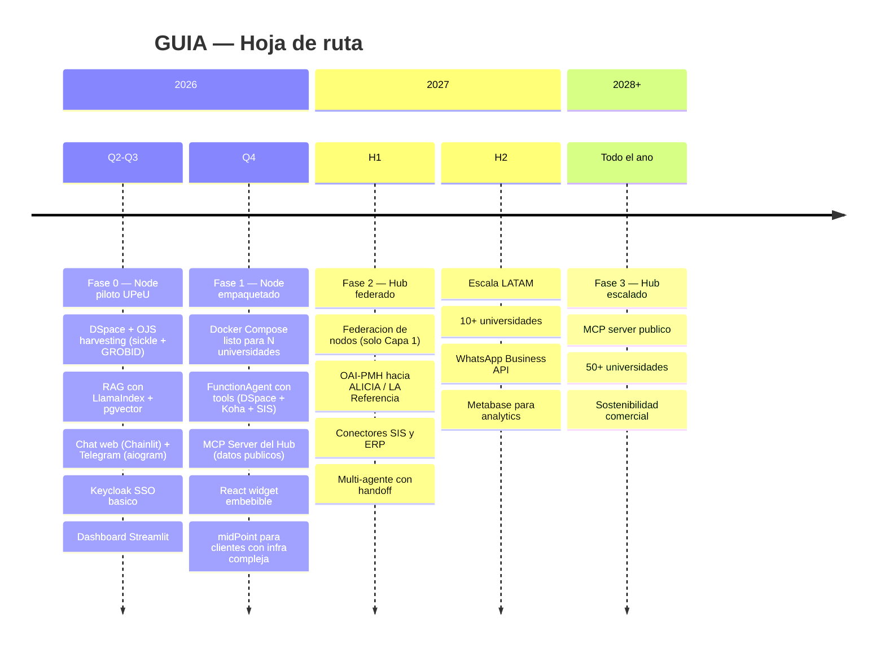
