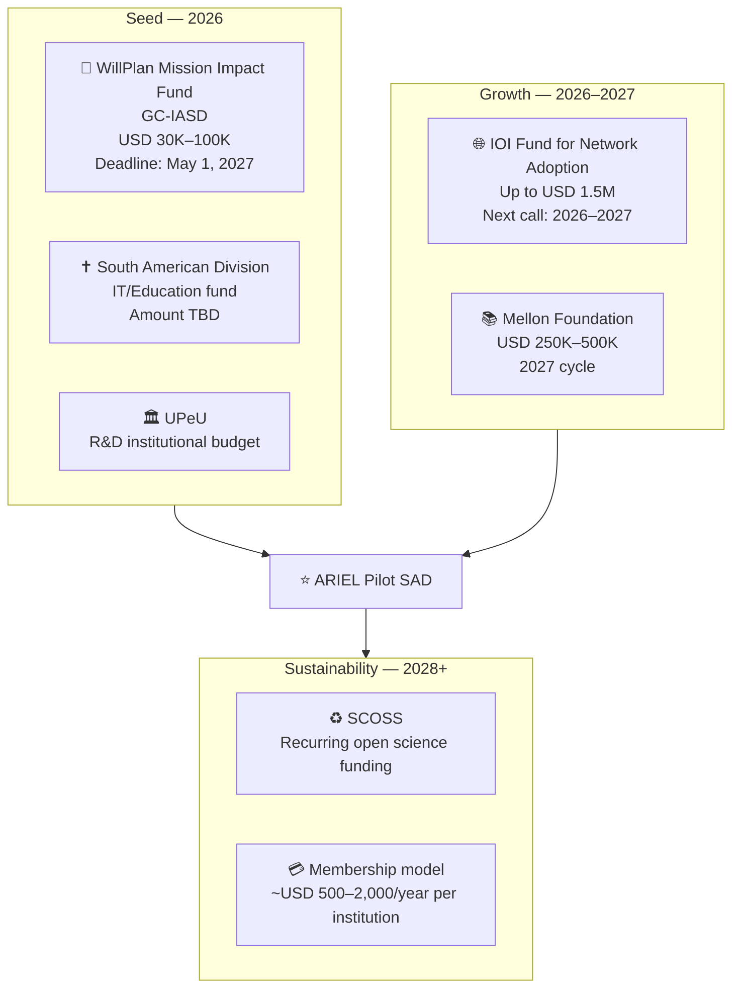

# Funding

## ARIEL Funding Pipeline

## Key funding sources

| Source | Amount | Type | Status |
|---|---|---|---|
| WillPlan Mission Impact Fund | $30K–$100K | Non-reimbursable | Open — UPeU applies |
| South American Division | TBD | Institutional | Pending negotiation |
| IOI Fund for Network Adoption | Up to $1.5M | Grant | Next call 2026–2027 |
| Mellon Foundation | $250K–$500K | Grant | 2027 cycle |
| SCOSS | Recurring | Sustainability | Phase 3 |

!!! success "IOI Fund precedent"
    The IOI Fund's inaugural cycle funded **LA Referencia** ($1.5M) — the Latin American repository network that is the direct model for ARIEL.
