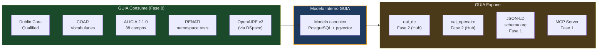
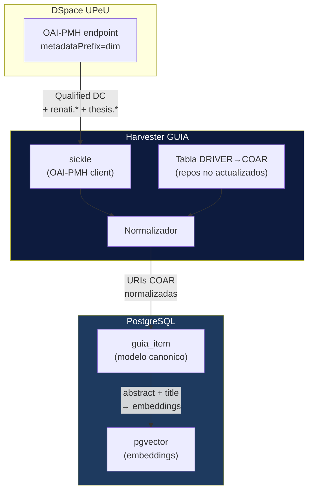
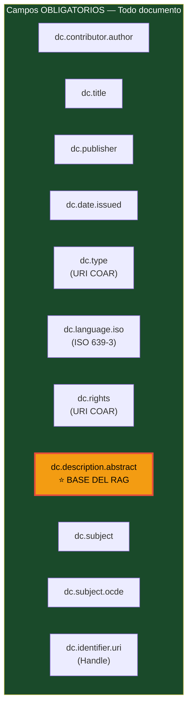
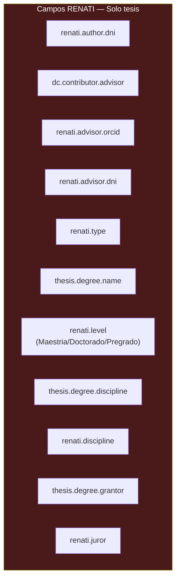
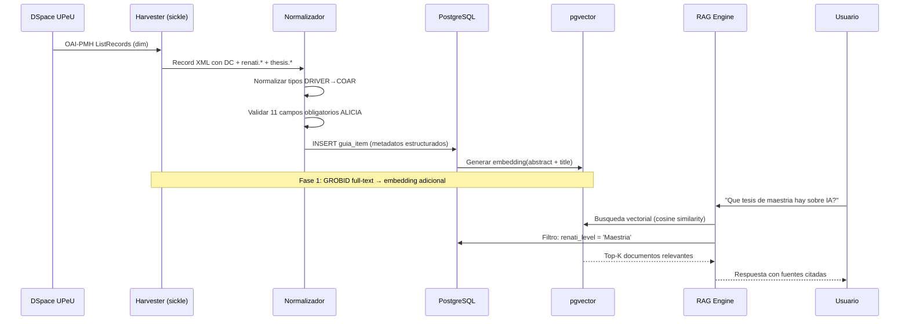

# Estandares y Schemas de Metadatos

## Estrategia: "Recolectar con amplitud, almacenar lo util, exponer lo requerido"

GUIA no intenta ser 100% compliant con todos los estandares desde el dia 1. Implementa lo necesario por fase.



---

## Estandares por fase

### Fase 0 — Consumir de DSpace/OJS peruanos



**Por que `metadataPrefix=dim` y no `oai_dc`:** DSpace Intermediate Metadata (`dim`) expone todos los campos calificados incluyendo `renati.*` y `thesis.*`. Simple DC (`oai_dc`) pierde esos campos. Cambio de 1 linea en el harvester:

```python
records = sickle.ListRecords(metadataPrefix='dim', set='col_...')
```

**Tabla de traduccion DRIVER→COAR** — para repositorios que no han actualizado a ALICIA 2.1.0:

```python
DRIVER_TO_COAR = {
    "info:eu-repo/semantics/doctoralThesis": "http://purl.org/coar/resource_type/c_db06",
    "info:eu-repo/semantics/masterThesis":   "http://purl.org/coar/resource_type/c_bdcc",
    "info:eu-repo/semantics/bachelorThesis":  "http://purl.org/coar/resource_type/c_7a1f",
    "info:eu-repo/semantics/article":        "http://purl.org/coar/resource_type/c_6501",
    "info:eu-repo/semantics/openAccess":     "http://purl.org/coar/access_right/c_abf2",
    "info:eu-repo/semantics/embargoedAccess":"http://purl.org/coar/access_right/c_f1cf",
    "info:eu-repo/semantics/restrictedAccess":"http://purl.org/coar/access_right/c_16ec",
    "info:eu-repo/semantics/closedAccess":   "http://purl.org/coar/access_right/c_14cb",
}
```

---

### Fase 1 — schema.org / JSON-LD para visibilidad web

Cuando el Hub o el dashboard del Node tengan paginas publicas de items, embeber JSON-LD en el `<head>`:

```json
{
  "@context": "https://schema.org",
  "@type": "Thesis",
  "name": "Contaminacion del suelo en la region Junin",
  "author": {"@type": "Person", "name": "Flores, Juan"},
  "datePublished": "2025-06-15",
  "inLanguage": "es",
  "url": "https://repositorio.upeu.edu.pe/handle/20.500.12840/1234",
  "description": "Se evaluo la concentracion de metales pesados...",
  "keywords": ["contaminacion", "suelo", "metales pesados"],
  "sourceOrganization": {"@type": "Organization", "name": "Universidad Peruana Union"}
}
```

**Tipos schema.org relevantes:** `ScholarlyArticle`, `Thesis`, `Book`, `Dataset`.

Google Scholar indexa automaticamente paginas con JSON-LD correcto = visibilidad gratuita.

---

### Fase 2 — OAI-PMH endpoint del Hub (OpenAIRE v4)

El Hub expone 3 `metadataPrefix`:

| Prefix | Estandar | Para quien |
|--------|---------|-----------|
| `oai_dc` | Simple Dublin Core | Obligatorio por protocolo OAI-PMH |
| `oai_openaire` | OpenAIRE v4 | OpenAIRE, redes europeas |
| `dim` | DSpace Intermediate | LA Referencia, agregadores LATAM |

Validar contra: `https://www.openaire.eu/validator-and-registration/`

---

## Vocabularios COAR

GUIA almacena URIs COAR, nunca strings libres.

### Tipos de recurso (dc.type)

| Tipo | URI COAR |
|------|----------|
| Tesis doctoral | `http://purl.org/coar/resource_type/c_db06` |
| Tesis de maestria | `http://purl.org/coar/resource_type/c_bdcc` |
| Trabajo de pregrado | `http://purl.org/coar/resource_type/c_7a1f` |
| Articulo original | `http://purl.org/coar/resource_type/c_2df8fbb1` |
| Articulo de revision | `http://purl.org/coar/resource_type/c_dcae04bc` |
| Preprint | `http://purl.org/coar/resource_type/c_816b` |
| Libro | `http://purl.org/coar/resource_type/c_2f33` |
| Capitulo de libro | `http://purl.org/coar/resource_type/c_3248` |
| Comunicacion congreso | `http://purl.org/coar/resource_type/c_5794` |
| Conjunto de datos | `http://purl.org/coar/resource_type/c_ddb1` |

### Derechos de acceso (dc.rights)

| Estado | URI COAR |
|--------|----------|
| Acceso abierto | `http://purl.org/coar/access_right/c_abf2` |
| Embargado | `http://purl.org/coar/access_right/c_f1cf` |
| Restringido | `http://purl.org/coar/access_right/c_16ec` |
| Cerrado | `http://purl.org/coar/access_right/c_14cb` |

---

## ALICIA 2.1.0 — Campos obligatorios

### 11 campos universales (todos los tipos de documento)



### Campos adicionales para tesis (RENATI/SUNEDU)



---

## Modelo interno canonico — PostgreSQL

```sql
CREATE TABLE guia_item (
    -- Identidad
    id              UUID PRIMARY KEY DEFAULT gen_random_uuid(),
    source_repo     TEXT NOT NULL,           -- URL base del repositorio
    source_id       TEXT NOT NULL,           -- OAI identifier
    handle          TEXT,                    -- dc.identifier.uri
    doi             TEXT,                    -- dc.identifier.doi

    -- Clasificacion (COAR URIs, nunca strings)
    resource_type   TEXT NOT NULL,           -- URI COAR dc.type
    access_right    TEXT NOT NULL,           -- URI COAR dc.rights
    language        TEXT,                    -- ISO 639-3

    -- Contenido principal
    title           TEXT NOT NULL,           -- dc.title
    title_alt       TEXT[],                  -- dc.title.alternative
    abstract        TEXT,                    -- dc.description.abstract (BASE DEL RAG)
    date_issued     DATE,                   -- dc.date.issued
    publisher       TEXT,                   -- dc.publisher
    source_journal  TEXT,                   -- dc.source / dc.relation.isPartOf

    -- Autores y responsables
    authors         JSONB,                  -- [{name, orcid, dni, order}]
    advisor         TEXT,                   -- dc.contributor.advisor (tesis)

    -- Clasificacion tematica
    subjects        TEXT[],                 -- dc.subject (palabras clave)
    subject_ocde    TEXT[],                 -- dc.subject.ocde

    -- RENATI / ALICIA Peru (nullable, solo tesis)
    renati_type     TEXT,                   -- renati.type
    renati_level    TEXT,                   -- renati.level
    degree_name     TEXT,                   -- thesis.degree.name
    degree_program  TEXT,                   -- thesis.degree.discipline
    degree_grantor  TEXT,                   -- thesis.degree.grantor

    -- RAG / pgvector
    embedding       VECTOR(1536),           -- embedding del abstract+title
    full_text       TEXT,                   -- texto completo via GROBID (Fase 1)

    -- Tracking
    harvested_at    TIMESTAMP DEFAULT NOW(),
    updated_at      TIMESTAMP DEFAULT NOW(),
    embargo_end     DATE,

    UNIQUE(source_repo, source_id)
);

-- Indice vectorial para busqueda semantica
CREATE INDEX ON guia_item USING ivfflat (embedding vector_cosine_ops);
```

---

## Flujo completo de metadatos



---

## Estandares descartados y por que

| Estandar | Razon de descarte | Alternativa |
|---------|-------------------|-------------|
| CERIF | Europeo, complejo, sin mandato en LATAM | Campos RENATI cubren el caso peruano |
| VIVO | Perfiles de investigadores, RDF complejo, sin adopcion LATAM | ORCID API directo (Fase 2) |
| MODS / METS | Preservacion digital, overkill para RAG | Dublin Core Qualified via `dim` |
| DRIVER | Superado por OpenAIRE v3/v4 desde 2014 | Tabla traduccion DRIVER→COAR |
| ETD-MS formal | Namespace propio NDLTD | Campos RENATI ya son equivalentes |
