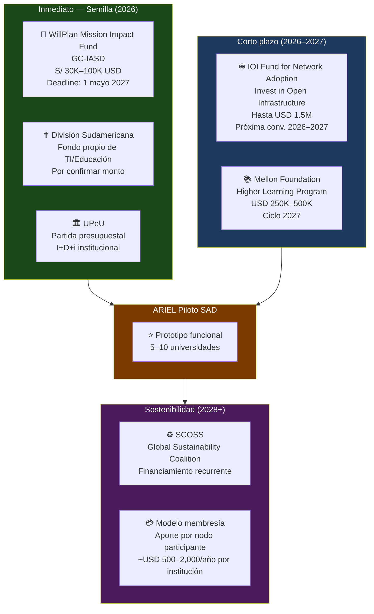
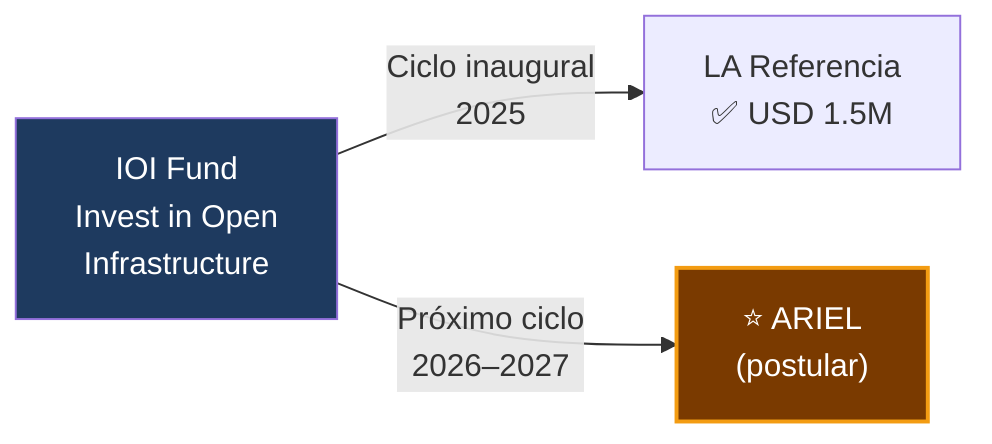
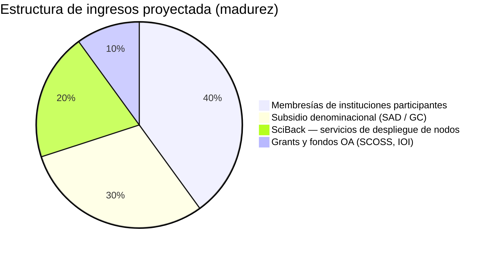
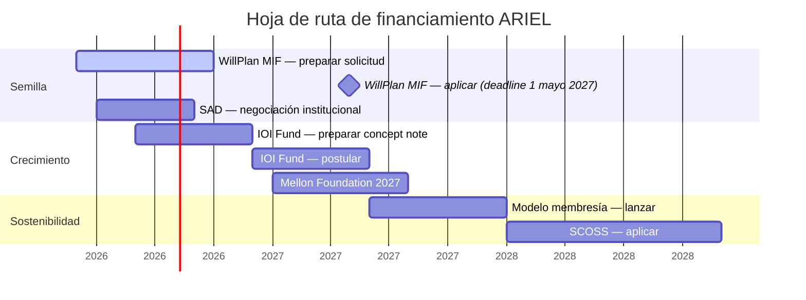

# Financiamiento

## Mapa completo de fuentes de financiamiento para ARIEL

---

## Visión general del pipeline

---

## Fuente 1 — WillPlan Mission Impact Fund (GC-IASD)

!!! info "Fondo denominacional adventista"
    Administrado por el departamento de **Planned Giving & Trust Services** de la Conferencia General. Financiado por herencias y legados de miembros adventistas.

| Campo | Detalle |
|---|---|
| **Monto** | USD $30,000 – $100,000 por proyecto |
| **Tipo** | No reembolsable |
| **Deadline** | 1 de mayo de cada año |
| **Solicitante** | Entidad adventista formal (UPeU → SAD → GC) |
| **Estado** | Abierto — ciclo 2027 |
| **Fit** | Alto si se enmarca como herramienta de misión educativa |

**Narrativa para la solicitud:** ARIEL como cumplimiento de Isaías 29:18 — hacer audibles y visibles los "libros" que las universidades adventistas producen. La red convierte la producción académica denominacional en testimonio de la misión educativa adventista ante el mundo.

---

## Fuente 2 — División Sudamericana (SAD)

!!! tip "Socio estratégico y co-financiador"
    La SAD tiene presupuesto propio para proyectos de tecnología educativa y puede co-financiar el piloto directamente, especialmente a través de IATec.

| Campo | Detalle |
|---|---|
| **Monto** | Por confirmar (negociación institucional) |
| **Tipo** | Aporte institucional / partida presupuestal |
| **Solicitante** | UPeU + IATec ante la SAD |
| **Ventaja** | No requiere convocatoria pública — decisión interna |
| **Palanca** | El piloto beneficia directamente a las 13 universidades de la SAD |

---

## Fuente 3 — IOI Fund for Network Adoption

!!! success "El fondo más alineado conceptualmente"
    Invest in Open Infrastructure financió a **LA Referencia** ($1.5M) — que es exactamente el modelo que ARIEL replica pero para la IASD.

| Campo | Detalle |
|---|---|
| **Monto** | Hasta USD $1,500,000 |
| **Tipo** | Grant no reembolsable |
| **Próxima convocatoria** | Estimada 2026–2027 |
| **Solicitante ideal** | UPeU + IATec + SAD como consorcio |
| **Precedente directo** | LA Referencia (América Latina) — ganador del ciclo inaugural |
| **URL** | investinopen.org |

---

## Fuente 4 — Mellon Foundation

| Campo | Detalle |
|---|---|
| **Monto** | USD $250,000 – $500,000 |
| **Tipo** | Grant — Higher Learning Program |
| **Ciclo** | 2027 (2026 cerrado) |
| **Preferencia** | Instituciones académicas formales como solicitantes |
| **Fit** | Moderado — prefieren proyectos con tracción ya demostrada |

---

## Fuente 5 — SCOSS (Sostenibilidad a largo plazo)

| Campo | Detalle |
|---|---|
| **Tipo** | Financiamiento recurrente para infraestructuras OA no comerciales |
| **Requisito** | Infraestructura activa, no comercial, con base de usuarios real |
| **Ciclo actual** | 2025–2027 |
| **Fit** | Alto en Fase 3 — cuando ARIEL tenga 50+ instituciones activas |
| **Precedentes** | LA Referencia, DOAB, OAPEN, PKP, Open Citations |

---

## Modelo de sostenibilidad post-seed

**Cuota por institución participante (estimación):**

| Tamaño institución | Cuota anual estimada |
|---|---|
| Pequeña (<500 estudiantes) | USD $500 |
| Mediana (500–3,000 estudiantes) | USD $1,000 |
| Grande (>3,000 estudiantes) | USD $2,000 |
| Universidad principal (Andrews, Loma Linda) | USD $5,000 |

Con 50 instituciones activas: ingresos base ~USD $50,000–$100,000/año — suficiente para cubrir operación del hub.

---

## Línea de tiempo de financiamiento

