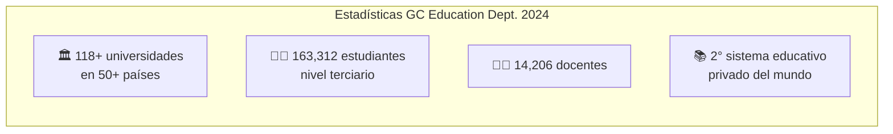
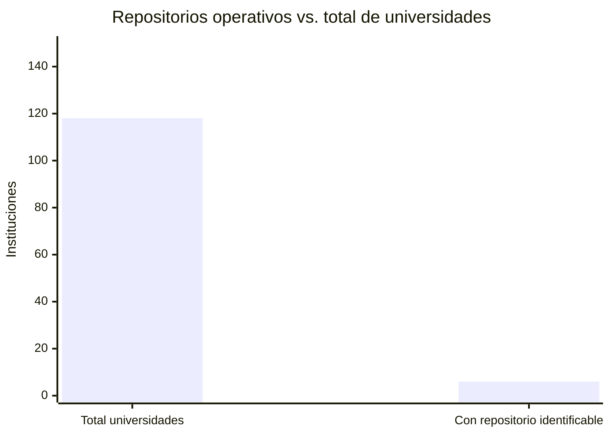
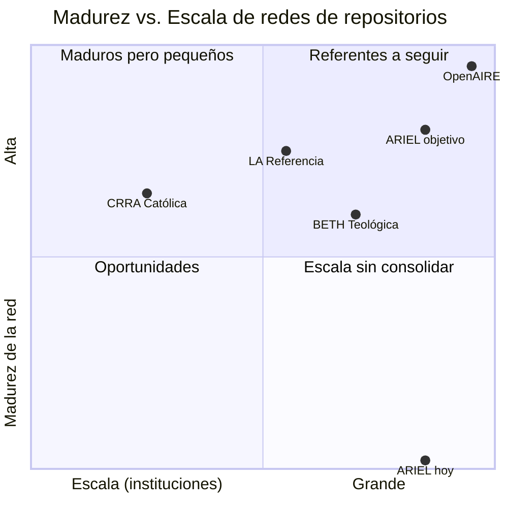
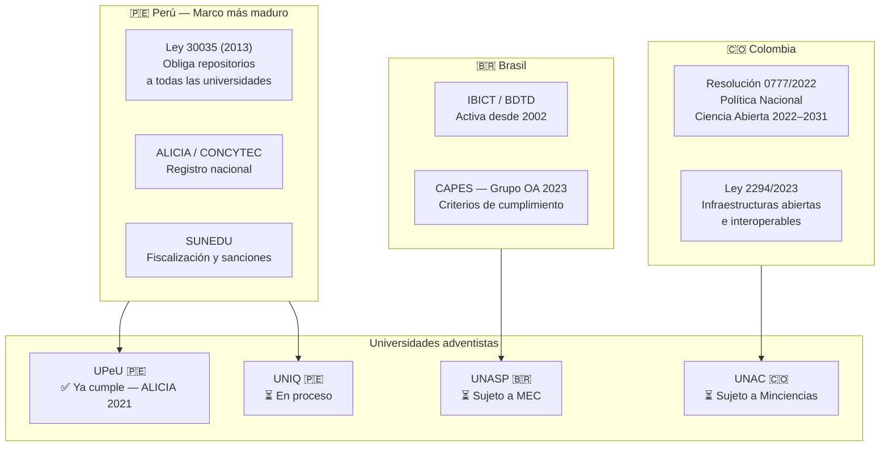

# Revisión de Literatura

## Evidencia empírica que justifica ARIEL

---

## Escala del sistema educativo adventista

| División | Instituciones |
|---|---|
| East-Central Africa (ECD) | 26 |
| Southern Asia-Pacific (SSD) | 21 |
| Inter-American (IAD) | 13 |
| North American (NAD) | 13 |
| **South American (SAD)** | **13** |
| Southern Asia (SUD) | 12 |
| Divisiones europeas | 10 |
| South Pacific (SPD) | 6 |
| Northern Asia-Pacific (NSD) | 5 |

*Fuente: [adventist.education/education-statistics](https://www.adventist.education/education-statistics/)*

---

## La brecha: repositorios confirmados vs. universo total

**Repositorios adventistas confirmados activos:**

| Institución | Plataforma | División |
|---|---|---|
| Andrews University (EEUU) | Digital Commons (BePress) | NAD |
| Loma Linda University (EEUU) | SCOPE | NAD |
| UPeU (Perú) | DSpace — aprobado ALICIA 2021 | SAD |
| Universidad de Montemorelos (México) | DSpace | IAD |
| Universidad Adventista de Colombia | Repositorio institucional | IAD |
| SETAI | Repositorio institucional | IAD |

**Tasa de adopción: < 5% del total. Sin federación entre ellas.**

---

## Andrews University: el proxy involuntario

!!! warning "El síntoma del problema"
    **10 de los 20 principales usuarios** del Digital Commons de Andrews University son otras universidades adventistas. El resto del sistema no tiene infraestructura propia y usa Andrews como proxy.

- Lanzado: junio 2015
- Primer millón de descargas: agosto 2018 (3 años)
- Visitantes de 191 países en períodos de 30 días
- 12,260+ documentos al primer millón

*Fuente: [nadadventist.org — Millionth Download](https://www.nadadventist.org/news/millionth-download-digital-commons-andrews-university/)*

---

## Comparación con redes equivalentes

| Red | Instituciones | Registros | Años |
|---|---|---|---|
| OpenAIRE | 2,209 fuentes | 193M publicaciones | 15 |
| LA Referencia | ~100 | 5M+ registros | 12 |
| CRRA (católica) | 50 | Miles (recursos raros) | 15 |
| BETH (teológica) | ~1,500 | 3M+ títulos | 50+ |
| **Red adventista actual** | **~6** | **Sin datos** | **No existe** |

---

## Marco regulatorio que presiona a las universidades adventistas

!!! danger "Ausencia crítica"
    La Conferencia General **no tiene ninguna política formal de acceso abierto**. ARIEL puede ser el catalizador para la primera política denominacional.

---

## Lecciones de proyectos similares

=== "LA Referencia (modelo a seguir)"
    - 12 años de operación, 10 países, ~100 universidades, 5M+ registros
    - Financiado por BID + gobiernos + IOI Fund ($1.5M ciclo inaugural 2025)
    - Interoperable con OpenAIRE desde el inicio
    - **Lección:** el mandato gubernamental y el financiamiento bilateral fueron clave

=== "CRRA Católica (advertencia)"
    - Catholic Research Resources Alliance: 50 instituciones, 15 años
    - En 2023 votaron **disolver la organización** y pasar a Atla
    - **Lección crítica:** sin mandato denominacional formal, la sostenibilidad falla
    - ARIEL necesita respaldo institucional de SAD/GC desde el inicio, no solo de individuos

=== "BETH Teológica (escalabilidad)"
    - 1,500 bibliotecas teológicas europeas de todas las denominaciones
    - Catálogo IxTheo: 3M+ títulos en OA
    - Bibliotecas adventistas europeas ya participan (Friedensau, Collonges, Newbold)
    - **Lección:** la cooperación ecuménica-denominacional es viable a gran escala

=== "ASDAL (red humana existente)"
    - Association of SDA Librarians — organización global activa
    - 4to Congreso Europeo de Bibliotecas Adventistas: Friedensau, junio 2024
    - 7 instituciones europeas participantes
    - Publica *ASDAL Action* y *Journal of Adventist Libraries and Archives*
    - **Oportunidad:** ASDAL ya tiene la red humana. ARIEL le da la infraestructura técnica.

---

## Impacto en rankings universitarios

Las universidades adventistas están en desventaja documentada en rankings que miden visibilidad digital:

- **Webometrics Transparent Ranking** mide repositorios por ítems en Google Scholar
- Universidades con repositorios robustos ascienden directamente en este ranking
- Esto impacta QS, THE y Scimago indirectamente
- Ninguna universidad adventista aparece en posiciones relevantes del Transparent Ranking

*Fuente: [repositories.webometrics.info/en/transparent](https://repositories.webometrics.info/en/transparent)*

---

## Referencias principales

- [adventist.education/education-statistics](https://www.adventist.education/education-statistics/)
- [digitalcommons.andrews.edu](https://digitalcommons.andrews.edu/)
- [lareferencia.info](https://www.lareferencia.info/)
- [openaire.eu/openaire-graph-2024-year-in-review](https://www.openaire.eu/openaire-graph-2024-year-in-review)
- [atla.com/learning-engagement/crra](https://www.atla.com/learning-engagement/crra/)
- [beth.eu](https://beth.eu/)
- [asdal.org](https://www.asdal.org/)
- [investinopen.org](https://investinopen.org/)
- [repositories.webometrics.info/en/transparent](https://repositories.webometrics.info/en/transparent)
